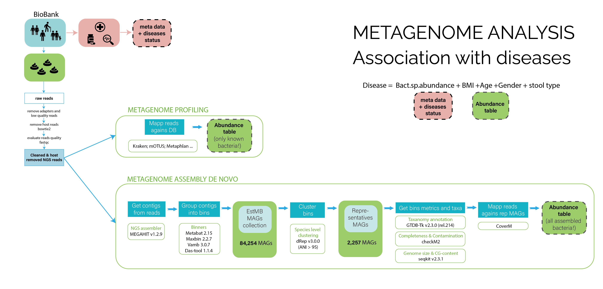

# Аналіз мікробіому
Це курс практичних занять підготовлений для Школи біоінформатики <b>BDS^3</b> (Ukrainian Biological Data Science School) в Ужгороді у 2024 році.
Метою серіі ноутбуків є обробка данних метагеному та виявлення ассоціаціі присутніх бактерій з захворюванням.
Код написан для версії Python 3.8.3. Використання інших версій Python може потребувати оптимізаціі коду.

Посилання на школу: https://www.bds3.org/

<h3>Загальна схема аналізу мікробіомних даних:</h3>

<h1>План практичного курсу</h1> 

<i>Курс має модульну структуру. Кожен ноутбук може бути викрористаний окремо.</i>

- <b>step1_metadata.ipynb</b>
Аналіз метаданих людей, зразки яких доступні до аналізу. Структура популяції. histogram, piechart, swarmplot, violinplot. 
- <b>step2_metagenome_profiling.ipynb</b>
Приклади результатів найпоширеніших програм для профілювання метагеному. Аналіз продуктивності програм за допомогою штучних даних. Вивчення barplot, swarmplot, scatterplot.
- <b>step3_mags_qual.ipynb</b>
Поняття MAG - Metagenome-Assembled Genomes чи геном, зібраний з метагеномних даних. Показники якості MAG. Чим відрізняється аналіз метагеному за допомогою профайлінгу та збірки геномів з метагеномних даних <i>de novo</i>?
- <b>step4_taxa.ipynb</b>
Аналіз та візуалізауія таксономії присутніх бактерій. Обговорення концепціі GTDB та різниці між ncbi та gtdb таксономією (додатковий скрипт - пошук аналогів назв видів між цими двома системами).
- <b>step5_MWAS.ipynb</b>
Пошук ассоціацій між бактеріями та хворобами (та іншими характеристиками).
- <b>step6_corr_plot.ipynb</b>
Візуалізація ассоціацій (MWAS analysis, heatplot)

